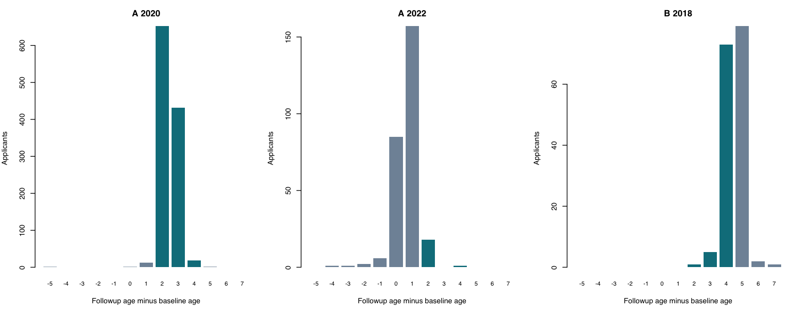

# Government subsidies, schooling and life outcomes

DIL applied assessment | Revised draft for applicant review | September 22, 2026

**Main population: municipality A, 2020 lottery applicants.** The policy question is whether offering the subsidy changes schooling, family formation and work. A2022 and B2018 are separate checks and do not enter the main estimate.

**The offer increases private-school attendance, but the five broader policy outcomes remain uncertain.** A2020 point estimates indicate slightly more schooling and less family formation and work. None of the five tests survives Holm adjustment. Weekly hours is nominally significant and should be described as suggestive rather than conclusive.

### Five policy outcomes: A2020 offer effects

| Outcome | Control mean | Offer effect | 95% CI | Raw p | Holm p | N |
| --- | --- | --- | --- | --- | --- | --- |
| School years since allocation | 3.608 | 0.093 | [-0.014, 0.200] | 0.089 | 0.268 | 1171 |
| Married / cohabiting (pp) | 1.73 | -0.88 | [-2.18, 0.41] | 0.181 | 0.363 | 1169 |
| Has a child (pp) | 3.63 | -1.26 | [-3.23, 0.70] | 0.206 | 0.363 | 1169 |
| Doing paid work (pp) | 19.00 | -4.13 | [-8.43, 0.17] | 0.060 | 0.238 | 1171 |
| Weekly work hours | 4.95 | -1.46 | [-2.76, -0.16] | 0.027 | 0.137 | 1171 |

Binary control means are percentages; effects and intervals are percentage points (pp). School years and weekly hours use original units. Confidence intervals are individual 95% HC2/t intervals. Holm p-values cover five policy outcomes. NR means inference is not reported.

The offer raises current private attendance by **15.91 pp** in A2020. This is a policy response and a first stage for an exploratory IV analysis. It does not establish that private schooling alone caused changes in the five outcomes.

### Three distinct questions

The lottery-offer effect is the principal causal policy estimand. Recipient ATT requires verified receipt histories that are unavailable. Private-school IV results require additional assumptions, including exclusion and no defiers. The report preserves unusual values, identifies exact conflicting records and shows targeted sensitivity checks.

---

## 1. Study design and population

The subsidy helps low-income students pay for private secondary school from grade 6. Renewal depends on academic progress and advancement. Oversubscribed municipalities allocate offers by lottery. Each applicant has one baseline and one follow-up record, with recalled schooling histories; the file is not a multiwave panel of contemporaneous school measurements.

| Cohort | Applicants | Selected | Not selected | Offer rate | Role |
| --- | --- | --- | --- | --- | --- |
| A 2020 | 1176 | 593 | 583 | 50.4% | Primary |
| A 2022 | 277 | 146 | 131 | 52.7% | Separate check |
| B 2018 | 165 | 91 | 74 | 55.2% | Separate check |

The main target is the 1,176 supplied A2020 applicants, not all municipal residents. The A2020 focus follows the applicant's clarification; no underlying emails were supplied or independently verified. All 1,618 IDs are unique and match one-to-one across files. This does not establish coverage of the original eligible lottery roster.

### A2020 baseline balance

| Characteristic | Control | Selected | Std. difference | p |
| --- | --- | --- | --- | --- |
| Male (%) | 50.09 | 50.25 | 0.003 | 0.954 |
| Baseline age | 12.63 | 12.56 | -0.049 | 0.415 |
| Phone recorded (%) | 100.00 | 100.00 | NR | NR |
| SES stratum | 1.99 | 2.01 | 0.033 | 0.600 |
| Baseline age missing (%) | 5.66 | 3.88 | -0.084 | 0.152 |
| SES missing (%) | 16.81 | 14.84 | -0.054 | 0.355 |
| Neighborhood missing (%) | 25.73 | 21.75 | -0.093 | 0.109 |

The primary joint check randomly relabels assignment 9,999 times within each cohort, holding arm counts and the full-baseline covariance fixed, and compares a Mahalanobis balance statistic (seed 20260922). A2020 p = **0.6038** (Monte Carlo SE 0.0049); A2022 p = 0.1162; B2018 p = 0.0152. This calibration assumes the stated applicant lottery and does not prove its implementation.

B2018 has notable age and phone imbalances, warranting caution. A sparse A2022 missing-age indicator makes a secondary HC2 joint-Wald diagnostic unstable; all five missing baseline ages are controls. Its extreme p-value is not used as evidence that the lottery failed. Individual balance p-values above are descriptive diagnostics.

---

## 2. Estimation and missing responses

**Unit:** applicant. **Assignment:** Z = selected in the lottery. For each cohort and outcome separately, fit **Y = alpha + tau Z + error**. Tau is the selected-minus-nonselected mean difference, estimating the intention-to-treat effect of the offer under valid assignment and response assumptions.

The A2020 primary model has an intercept and assignment only. Binary outcomes use linear mean differences for interpretation in percentage points. Outcomes are not restricted to applicants who are privately schooled, enrolled, working, receiving aid or complete on other outcomes. Weekly hours includes reported zero hours.

**Inference:** applicant-level HC2 standard errors with t-reference intervals and residual degrees of freedom. The unadjusted two-group variance equals s1 squared/n1 + s0 squared/n0. The municipality-year cohorts are strata, not three treatment clusters. Household/school links would be needed to assess dependence and spillovers; current school choice must not define post-treatment clusters.

### A2020 item missingness

| Outcome | Missing control | Missing selected | Applicants | Difference p |
| --- | --- | --- | --- | --- |
| School years since allocation | 4 | 1 | 1176 | 0.175 |
| Married / cohabiting | 5 | 2 | 1176 | 0.248 |
| Has a child | 5 | 2 | 1176 | 0.248 |
| Doing paid work | 4 | 1 | 1176 | 0.175 |
| Weekly work hours | 4 | 1 | 1176 | 0.175 |
| Currently enrolled | 5 | 2 | 1176 | 0.248 |
| Currently private | 10 | 3 | 1176 | 0.048 |
| Highest grade completed | 0 | 0 | 1176 | 1.000 |
| Grade repetitions | 4 | 1 | 1176 | 0.175 |

Primary models omit only missing values of their own outcome. Full-applicant interpretation additionally requires observed responses to represent their assignment arm; similar response rates cannot establish this. IV models require both outcome and private-school status, so their sample sizes differ from the policy ITTs.

The policy five form one Holm family; the retained schooling four form another. These families were chosen during this revision, not preregistered. The combined nine-outcome correction is a broader sensitivity. Confidence intervals are individual, not simultaneous. In A2022 zero-event family outcomes, descriptive means remain reported but degenerate normal/t intervals and p-values are suppressed.

---

## 3. Interpreting the five policy outcomes

**School years since allocation:** the estimate is small and its interval includes zero. The outcome is reported years completed since allocation, not lifetime attainment. The accounting convention and follow-up dates remain uncertain; retain the source values and their timing flags.

**Marriage/cohabitation and parenthood:** negative estimates are imprecise, with uncommon events. The data do not establish prevention or delay of family formation. Current status does not date when an event occurred.

**Paid work and hours:** both estimates point downward. Mean hours covers everyone with observed hours, including zeros, and combines whether and how much applicants work. Conditioning on working would select on a possible treatment response. Less work may free time for school, but without earnings, learning, preferences and costs it is not automatically a welfare gain.

### Sensitivity to baseline adjustment: A2020

| Outcome | Unadjusted | Adjusted | Adjusted 95% CI | N |
| --- | --- | --- | --- | --- |
| School years since allocation | 0.093 | 0.071 | [-0.033, 0.174] | 1171 |
| Married / cohabiting (pp) | -0.88 | -0.71 | [-2.04, 0.61] | 1169 |
| Has a child (pp) | -1.26 | -1.04 | [-2.98, 0.90] | 1169 |
| Doing paid work (pp) | -4.13 | -3.53 | [-7.59, 0.54] | 1171 |
| Weekly work hours | -1.46 | -1.27 | [-2.50, -0.05] | 1171 |

Adjustment uses sex, recorded phone, baseline age and SES, mean imputation of missing baseline values with missingness flags, and assignment interactions. Covariates are centered within the target cohort. No follow-up age, parental reports, receipt, school choice or work variables are controls. This is a comparability/precision check, not a replacement for random assignment.

A broader correction across all nine outcomes is reported in the CSVs. It leaves no policy-five test significant at 5%; private attendance and highest grade remain significant, while repetitions do not. Targeted exclusions and HC3 checks appear later. A flag is not an automatic error, and records are never removed merely to improve significance.

**Policy implication:** the data support increased private attendance and suggest less work time, but do not establish broad improvement across the five outcomes or provide enough information for cost-effectiveness or scale-up recommendations.

---

## 4. Schooling outcomes and instrument relevance

| A2020 outcome | Control mean | Effect | 95% CI | Raw p | Holm p | N |
| --- | --- | --- | --- | --- | --- | --- |
| Currently enrolled (pp) | 82.53 | 2.08 | [-2.18, 6.33] | 0.339 | 0.339 | 1169 |
| Currently private (pp) | 53.75 | 15.91 | [10.38, 21.44] | <0.001 | <0.001 | 1163 |
| Highest grade completed | 7.472 | 0.188 | [0.079, 0.296] | <0.001 | 0.002 | 1176 |
| Grade repetitions | 0.247 | -0.065 | [-0.119, -0.011] | 0.019 | 0.038 | 1171 |

The four retained schooling outcomes form their own Holm family. Grade completion and repetition describe progression; they remain complementary to the prioritised policy outcomes. Current private attendance is both a policy response and the proposed IV first stage.

### Lottery effects on private schooling

| Cohort | Private-school measure | Effect (pp) | 95% CI (pp) | Robust F | N |
| --- | --- | --- | --- | --- | --- |
| A2020 | Started G6 privately | 5.96 | [2.66, 9.26] | 12.6 | 1162 |
| A2020 | Started G7 privately | 16.74 | [11.92, 21.56] | 46.4 | 1162 |
| A2020 | Currently private | 15.91 | [10.38, 21.44] | 31.9 | 1163 |
| A2022 | Started G6 privately | -2.16 | [-9.88, 5.56] | 0.3 | 275 |
| A2022 | Started G7 privately | 16.48 | [5.95, 27.01] | 9.5 | 275 |
| A2022 | Currently private | 15.99 | [5.56, 26.42] | 9.1 | 275 |
| B2018 | Started G6 privately | 26.83 | [12.41, 41.26] | 13.5 | 163 |
| B2018 | Started G7 privately | 21.54 | [6.59, 36.48] | 8.1 | 163 |
| B2018 | Currently private | 18.55 | [3.15, 33.95] | 5.7 | 162 |

A2020 current private attendance averages 53.75% in controls and 69.66% in selected applicants. Control attendance shows two-sided uptake: applicants may pay privately using other resources. Current aid is not equivalent to assignment or verified program receipt.

A2022 has a negative G6 point estimate but positive G7/current estimates. Sampling uncertainty and treatment definition matter. A positive first stage supports relevance but does not prove exclusion or no defiers. Each IV outcome below recomputes its first stage on that outcome's complete-case sample; the table above uses all observed responses for the schooling measure.

---

## 5. Observed exits from private schooling

An observed G6-to-current exit has started_g6_private = 1 and in_private_now = 0. The denominator includes G6-private applicants with current status observed. Missing current status stays unknown. G6 private attendance is itself post-allocation, so conditioning on it changes group composition: the exit-rate comparison is descriptive, not causal.

| Cohort / arm | G6 private, status observed | Current nonprivate | Exit rate | Still enrolled | Not enrolled |
| --- | --- | --- | --- | --- | --- |
| A2020 control | 498 | 208 | 41.77% | 127 | 81 |
| A2020 selected | 552 | 150 | 27.17% | 68 | 82 |
| A2022 control | 115 | 32 | 27.83% | 25 | 7 |
| A2022 selected | 126 | 11 | 8.73% | 8 | 3 |
| B2018 control | 38 | 13 | 34.21% | 9 | 4 |
| B2018 selected | 70 | 20 | 28.57% | 7 | 13 |

Current-status unknown among G6-private applicants (control / selected): A2020 5 / 2; A2022 0 / 1; B2018 0 / 1. All observed exits have current enrollment observed. Current enrollment outside private school is consistent with switching sector; nonenrollment may reflect withdrawal or completion, so it is not automatically called dropout.

| Selected A2020 ID | G6 / G7 / current private | Current enrollment | Handling |
| --- | --- | --- | --- |
| 100031 | 1 / 1 / 0 | 1 | Retain: currently enrolled nonprivately |
| 100036 | 1 / 0 / 0 | 0 | Retain: reason for nonenrollment unknown |
| 100062 | 1 / 0 / 1 | 1 | Retain reported return pattern |
| 100203 | 1 / 1 / unknown | unknown | Current transition remains unknown |
| 100449 | 1 / 1 / unknown | 1 | Enrollment does not resolve school sector |

A2020 has 60/554 selected G6-private students reporting no private G7 start, versus 125/503 controls. G7 = 0 can include applicants who never reached G7. The 1/0/1 pattern occurs 23 times overall (seven selected A2020); exact transition dates and reasons are unavailable. A broader definition, private in G6 or G7 then nonprivate currently, finds 439 exits, including 184 selected applicants. It differs from the G6-only table.

**These are not identified defiers.** A defier would be private without an offer but nonprivate with one at the same defined time. Only one of those counterfactual choices is observed. Leaving, renewal failure, returning to private school or a positive average first stage cannot classify individual compliance types. All matching IDs and original histories remain in the transition audit.

---

## 6. ATT depends on what treatment means

An average treatment effect on the treated (ATT) requires a precise treatment definition. An offer, actual subsidy receipt and private schooling are different treatments.

| Treatment | Target | What can be identified |
| --- | --- | --- |
| Lottery offer Z | Effect among applicants offered the subsidy | Under random assignment, offer ATT equals the offer ATE in expectation. The policy ITT estimates this offer effect. |
| Actual program receipt S | E[Y(1) - Y(0) \| S = 1] | Not identified here: program-specific take-up and renewal histories are missing, and recipients select into use and retention. |
| Private schooling D | Effect among all privately schooled applicants | Not generally identified by offer IV. Always-takers attend privately under either assignment, and their schooling effects are unidentified. |

### Why current aid does not identify recipient ATT

Recipients can differ in family resources, preferences, access and academic performance. Renewal depends on progress, so current receipt may result from earlier outcomes. A comparison of recipients and nonrecipients, even with observed controls, does not automatically estimate ATT.

receiving_aid_now denotes **any subsidy or scholarship in the survey year**: 56.25% among A2020 selected applicants and 5.53% among controls. It is not a verified initial-receipt or renewal history for this program. Dividing the ITT by this any-aid difference and calling it program-recipient ATT is unsupported.

### When a recipient-IV could equal recipient ATT

With verified program-specific receipt, one-sided noncompliance S(0) = 0, exclusion and the other IV assumptions, all recipients are compliers. The local recipient effect then coincides with recipient ATT. These conditions cannot be established using the supplied any-aid field; access by controls or time-varying receipt would change the interpretation.

For private schooling, substantial control uptake demonstrates that compliance is two-sided. Under standard IV assumptions, the ratio is a LATE for applicants whose private attendance changes because of the offer. It is not the average effect for all privately schooled applicants or all subsidy recipients.

### Needed to move beyond discussion

Obtain program-specific initial receipt, annual disbursements and renewal dates; verify whether controls can access this program; define treatment as any receipt, amount or duration; and justify exclusion for that definition. Until then, a numerical program-recipient ATT would imply information the files do not contain.

---

## 7. Instrumenting private schooling with the offer

**Instrument:** Z = selected in the lottery. **Endogenous treatment:** D = in_private_now. Estimate the five outcomes separately within each cohort. Current aid use is a realised follow-up variable and is not the instrument.

**First stage:** D = alpha_D + pi Z + v. **Reduced form:** Y = alpha_Y + rho Z + e. **Just-identified 2SLS:** beta_IV = rho / pi.

For each outcome, all three calculations use the identical applicants with observed Y and D. The main policy ITT uses all observed Y and can differ from this reduced form. Never divide a full-outcome ITT by a first stage from a different sample.

| Assumption | Assessment |
| --- | --- |
| Random assignment | Maintain the documented within-cohort lottery; inspect baseline balance and obtain the complete roster and procedure. |
| Relevance | Report the same-sample first-stage effect and robust F. Strength does not validate the remaining assumptions. |
| Exclusion | The offer must affect the outcome only through the defined private-school treatment. Fee relief, renewal incentives and earlier schooling threaten this condition. |
| Monotonicity | At the same defined time, no applicant attends privately only without an offer. Observed transitions cannot identify these counterfactual types. |
| No interference / defined treatment | Peer, capacity and spillover effects are unmeasured; the meaning of private-school treatment must be coherent. |

**Exclusion is demanding for a current snapshot.** The subsidy can free household resources or encourage effort without changing current sector. Prior private schooling and duration may affect cumulative years, work and family outcomes even when current attendance is the same. Some outcomes may precede the current attendance decision. The resulting private-school interpretation is therefore exploratory and conditional.

The robust ratio variance retains the joint covariance of reduced form and first stage. Ordinary second-stage OLS standard errors are incorrect. Anderson-Rubin (AR) sets invert the HC2/t test of Y - beta D on assignment and allow bounded, disjoint or unbounded sets. This is asymptotic robust inference, not an exact randomization test. LATE identification follows Angrist, Imbens and Rubin (1996); references appear on the final page.

---

## 8. A2020 private-school IV results

| Outcome | IV effect | 95% robust AR set | AR p | AR Holm p | N |
| --- | --- | --- | --- | --- | --- |
| School years since allocation | 0.497 | [-0.209, 1.094] | 0.146 | 0.292 | 1162 |
| Married / cohabiting (pp) | -6.64 | [-15.51, 1.29] | 0.097 | 0.292 | 1161 |
| Has a child (pp) | -9.09 | [-22.14, 3.26] | 0.141 | 0.292 | 1161 |
| Doing paid work (pp) | -24.80 | [-52.93, 2.43] | 0.072 | 0.286 | 1162 |
| Weekly work hours | -8.98 | [-17.60, -0.88] | 0.032 | 0.158 | 1162 |

Binary effects and sets are percentage points; other units are years and hours/week. AR p tests a zero effect; Holm covers the five A2020 IV outcomes. Sets are individual, not simultaneous. Conventional robust 2SLS intervals are included in the machine-readable tables.

### The matched samples behind each ratio

| Outcome | Reduced form | First stage (pp) | Robust F | Control N | Selected N |
| --- | --- | --- | --- | --- | --- |
| School years since allocation | 0.079 | 15.99 | 32.19 | 572 | 590 |
| Married / cohabiting | -1.07 | 16.11 | 32.67 | 572 | 589 |
| Has a child | -1.46 | 16.11 | 32.67 | 572 | 589 |
| Doing paid work | -3.97 | 15.99 | 32.19 | 572 | 590 |
| Weekly work hours | -1.44 | 15.99 | 32.19 | 572 | 590 |

Reduced forms use years, percentage points for binary outcomes, or hours/week; all first stages use percentage points. For school years, the matched reduced form is about 0.079 and the first stage about 0.160, yielding 0.497 years. The policy ITT of 0.093 uses more observed outcomes and must not be substituted into that ratio.

None of the five IV tests survives multiplicity adjustment. Weekly hours has an AR set excluding zero before adjustment, but its Holm p is about 0.158. The sizeable point estimate is not an established private-school effect. A2020 first-stage F values of about 32 do not validate exclusion or monotonicity.

### Baseline-adjusted IV check

With additive pretreatment controls, the weekly-hours IV estimate is -8.157, with AR set [-17.08, 0.03]. This set includes zero, reinforcing the uncertainty. Unlike the assignment-interacted policy adjustment, this IV check uses additive controls in the instrument and outcome equations.

If the IV assumptions hold, the effect applies to applicants whose current private attendance is induced by the offer. It does not generalize to all private-school students, subsidy recipients or municipal residents. The histories and financial-support mechanisms limit a literal current-private LATE interpretation.

---

## 9. Separate checks in A2022 and B2018

A2022 is a newer cohort in the same municipality; B2018 is an older cohort elsewhere. Age and schooling patterns are consistent with shorter/longer exposure, but dates are absent. Comparisons also mix applicant age, composition, calendar time and municipality; they cannot isolate duration or place effects.

### A2022: five policy offer effects

| Outcome | Effect | 95% CI | Raw p | Holm p | N |
| --- | --- | --- | --- | --- | --- |
| School years since allocation | 0.029 | [-0.078, 0.136] | 0.596 | 1.000 | 275 |
| Married / cohabiting (pp) | 0.00 | NR | NR | NR | 274 |
| Has a child (pp) | 0.00 | NR | NR | NR | 273 |
| Doing paid work (pp) | -2.45 | [-8.98, 4.07] | 0.460 | 1.000 | 275 |
| Weekly work hours | -0.21 | [-1.86, 1.45] | 0.807 | 1.000 | 275 |

### B2018: five policy offer effects

| Outcome | Effect | 95% CI | Raw p | Holm p | N |
| --- | --- | --- | --- | --- | --- |
| School years since allocation | 0.071 | [-0.381, 0.524] | 0.756 | 1.000 | 164 |
| Married / cohabiting (pp) | -3.18 | [-9.25, 2.89] | 0.302 | 1.000 | 164 |
| Has a child (pp) | -0.96 | [-7.74, 5.82] | 0.780 | 1.000 | 164 |
| Doing paid work (pp) | 0.12 | [-13.27, 13.51] | 0.986 | 1.000 | 164 |
| Weekly work hours | -0.41 | [-4.28, 3.46] | 0.834 | 1.000 | 164 |

**A2022 has no observed marriage/cohabitation or parenthood events in either arm.** The descriptive difference is zero, but this is not a precisely estimated zero population effect. Conventional robust SEs collapse, so their confidence intervals and p-values are not reported.

Smaller samples and different event prevalence limit these checks. A difference in significance does not establish a difference in effects. B2018 also has baseline imbalances. The separate cohorts provide context for the A2020 analysis, not clean estimates of elapsed-time or municipality effects.

---

## 10. IV checks across cohorts and exposures

### A2022: current-private IV

| Outcome | IV effect | 95% robust AR set | First-stage F | N |
| --- | --- | --- | --- | --- |
| School years since allocation | 0.190 | [-0.736, 1.106] | 8.54 | 274 |
| Married / cohabiting (pp) | 0.00 | NR: no events | 7.98 | 273 |
| Has a child (pp) | 0.00 | NR: no events | 8.21 | 272 |
| Doing paid work (pp) | -15.53 | [-78.10, 36.20] | 8.54 | 274 |
| Weekly work hours | -1.26 | [-14.49, 14.36] | 8.54 | 274 |

### B2018: current-private IV

| Outcome | IV effect | 95% robust AR set | First-stage F | N |
| --- | --- | --- | --- | --- |
| School years since allocation | 0.412 | [-6.114, 3.087] | 5.66 | 162 |
| Married / cohabiting (pp) | -16.89 | [-100.95, 25.43] | 5.66 | 162 |
| Has a child (pp) | -4.64 | [-58.72, 73.30] | 5.66 | 162 |
| Doing paid work (pp) | 3.64 | [-82.10, 207.21] | 5.66 | 162 |
| Weekly work hours | -1.55 | [-32.26, 44.00] | 5.66 | 162 |

First stages are weaker in these samples: roughly F = 8 in A2022 and F = 6 in B2018. Unrestricted approximate IV sets can extend beyond the logical +/-100 pp range for binary causal effects; these are not probability predictions. Their width indicates weak information. Zero-event A2022 outcomes have no reported inferential AR set.

### Alternative treatment definitions

The package also instruments private starts in G6 and G7, with matched samples for each outcome. These indicate different exposures and potentially different compliers, so their ratios are sensitivity checks rather than interchangeable estimates. In A2020 the G6 first stage is much smaller than G7/current attendance.

A2022 G6 has a weak negative point first stage. Its ratio should not be interpreted as the same positively induced complier effect without defending a coherent monotonicity direction. Earlier measures do not automatically solve exclusion because the offer changes resources, duration and renewal incentives beyond one binary school measure.

---

## 11. How the data were checked and handled

I inspected raw tokens, types, distinct values, ranges, missingness, nonfinite values, fractional integer fields and common sentinels; checked duplicate/missing IDs and exact merge coverage; compared dictionary domains; tabulated missingness by cohort and assignment; and checked cross-field consistency. All original columns remain unchanged.

| Finding | Count / scope | Handling |
| --- | --- | --- |
| Missing / duplicate / unmatched IDs | 0 / 0 / 0 | One-to-one merge; retain 1,618 applicants. |
| Invalid documented codes / sentinels | None detected | No blanket recoding, winsorization or outlier deletion. |
| Dictionary month mismatch | interview_month vs survey_month | Keep actual field name; document assumed alias. |
| Baseline age / SES missing | 64 / 279 | Preserve NA; adjustment uses explicit imputation and flags. |
| Neighborhood missing | 721 | All A2022/B2018 plus 279 A2020; omit from main controls. |
| Age change outside +2 to +4 | 350 / 1,549 observed pairs | Timing review flags; not 350 verified errors or an exclusion rule. |
| Age declines | 11 | Print IDs; preserve raw ages; mark age derivative missing. |
| Grade completion conflicts | 14 applicants | Retain reports; targeted exclusion sensitivity. |
| Parent no older than child | 5 cells | Only affected parent-age derivative becomes missing. |
| No work, positive hours | 1 applicant | Retain reports; targeted exclusion check. |
| Working, zero weekly hours | 32 applicants | Retain zeros; reference periods/absence may explain them. |

The issue ledger records ID, cohort, assignment, raw values, rule, severity and handling. Counts overlap and cannot be summed into unique exclusions. Missing outcomes are never filled with zero. Zero parental schooling and work hours remain valid reported values unless other evidence contradicts them.

ID **100538**, an A2022 control, reports highest grade 4 despite a private G6 start. The dictionary gives no explicit highest-grade range: preserve grade 4, flag the entry-history concern and check exclusion. Baseline grade and source questionnaires are needed to resolve it. The case lies outside the revised primary cohort.

---

## 12. Age timing and school-year definitions

The study describes follow-up approximately three years after application. I calculate survey age minus baseline age without assuming either field correct. There are 64 missing baseline ages, six missing survey ages and one overlap: 1,549 comparable pairs and 69 unknown pairs. The +2 to +4 window allows rough timing and birthdays but is a diagnostic screen only.

| Cohort | Age pairs | Mean change | Median | Outside +2 to +4 | Declines |
| --- | --- | --- | --- | --- | --- |
| A 2020 | 1117 | 2.40 | 2 | 16 | 1 |
| A 2022 | 271 | 0.66 | 1 | 252 | 10 |
| B 2018 | 161 | 4.49 | 5 | 82 | 0 |

Application year plus age change is 2022 or 2023 for 1,477/1,549 pairs (95.4%). This is consistent with a common survey period but is an inference from ages, not an observed interview year. Exact elapsed time cannot be recovered.

| Cohort | School-years N | Mean | Modal value (N) | Values above 4 |
| --- | --- | --- | --- | --- |
| A2020 | 1171 | 3.655 | 4 (875) | 47 |
| A2022 | 275 | 2.062 | 2 (235) | 1 |
| B2018 | 164 | 5.201 | 6 (116) | 128 |

The dictionary defines years_in_school as school years completed since allocation. There are 176 values above four; 718 exceed age change plus one; 18 are below highest grade minus five, a screen assuming grade 5 completed at entry. Dates, accounting conventions or age errors may explain these flags. Retain reported values; do not cap at three or discard B2018's longer histories.

The requested school-years outcome remains primary and is not silently replaced with highest grade. Keep its measurement caveat beside the estimate and use grade/repetition as complementary evidence.

---

## 13. The 11 decreasing-age records

| Applicant ID | Cohort | Selected | Baseline age | Survey age | Change |
| --- | --- | --- | --- | --- | --- |
| 100044 | A 2022 | 0 | 15 | 13 | -2 |
| 100133 | A 2022 | 1 | 13 | 12 | -1 |
| 100368 | A 2020 | 0 | 15 | 10 | -5 |
| 100628 | A 2022 | 1 | 14 | 11 | -3 |
| 100849 | A 2022 | 0 | 12 | 10 | -2 |
| 100910 | A 2022 | 1 | 17 | 13 | -4 |
| 101003 | A 2022 | 0 | 14 | 13 | -1 |
| 101026 | A 2022 | 1 | 14 | 13 | -1 |
| 101503 | A 2022 | 1 | 15 | 14 | -1 |
| 101508 | A 2022 | 1 | 14 | 13 | -1 |
| 101532 | A 2022 | 0 | 13 | 12 | -1 |

ID **100368** in A2020 changes from 15 to 10; ID **100910** in A2022 from 17 to 13. These are inconsistent age pairs. Unique matching IDs do not reveal whether baseline age, survey age or another record field is wrong. No reliable correction can be inferred.

**Handling:** preserve both original age columns and all outcomes. age_at_survey_clean becomes missing for these 11 applicants, marking unusable chronology rather than asserting survey age caused the discrepancy. Primary outcomes do not control for age. The adjusted check uses reported baseline age and a separate exclusion sensitivity.

One negative-age case is A2020 and ten are A2022; none is B2018. The revised A2020 age-exclusion sensitivity removes only the relevant one applicant. Removing all 350 off-window records would disproportionately discard comparison cohorts and is not a main cleaning rule.

### Review files and unresolved chronology

There are also 86 unchanged ages, concentrated in A2022. These may reflect timing or measurement issues and remain flagged and retained. age_review_records.csv contains all 419 unique applicants with missing age pairs or off-window changes, with raw ages, ID, cohort, assignment and flags.

Age exclusions test sensitivity rather than repair the source data. Follow-up-based exclusions can change comparability. Birth dates, application/interview dates and source questionnaires are needed; setting survey age to baseline plus three would invent a correction.

---

## 14. Grade, parent-age and work conflicts

| Applicant ID | Cohort | Selected | Highest grade | Finished G6 / G7 / G8 |
| --- | --- | --- | --- | --- |
| 100088 | B 2018 | 1 | 9 | 0 / 0 / 0 |
| 100203 | A 2020 | 1 | 11 | 0 / 0 / 0 |
| 100411 | B 2018 | 0 | 11 | 0 / 0 / 0 |
| 100466 | A 2020 | 0 | 8 | 0 / 0 / 0 |
| 100606 | B 2018 | 1 | 11 | 0 / 0 / 0 |
| 100704 | A 2020 | 1 | 11 | 0 / 0 / 0 |
| 100709 | B 2018 | 0 | 11 | 0 / 0 / 0 |
| 100734 | A 2022 | 1 | 6 | 0 / 0 / 0 |
| 100736 | A 2020 | 1 | 11 | 0 / 0 / 0 |
| 100769 | A 2020 | 0 | 11 | 0 / 0 / 0 |
| 100823 | B 2018 | 1 | 8 | 0 / 0 / 0 |
| 100831 | A 2020 | 1 | 8 | 0 / 0 / 0 |
| 101173 | B 2018 | 1 | 10 | 0 / 0 / 0 |
| 101591 | A 2020 | 0 | 10 | 0 / 0 / 0 |

All 14 report highest grade at least 6 and all three completion flags zero. Thirteen contradict all thresholds; ID 100734 contradicts G6 only. Nine are selected, five controls. No source establishes which field is authoritative. Retain direct reports, do not generate completion from disputed highest grade, and compare targeted exclusions.

| Applicant ID | Child survey age | Flagged parent age | Clean derivative |
| --- | --- | --- | --- |
| 100389 | 14 | Mother 14 | Mother age missing |
| 100421 | 13 | Mother 8 | Mother age missing |
| 100659 | 16 | Father 1 | Father age missing |
| 100840 | 15 | Mother 15 | Mother age missing |
| 101329 | 16 | Mother 16 | Mother age missing |

Two other parent-child gaps below 12 and three above 60 receive review flags without correction. Parent ages are not main controls. ID **100767** reports working = 0 but four weekly work hours: retain both and check exclusion. The 32 working applicants with zero weekly hours retain zero because reference periods or temporary absence may differ.

---

## 15. Sex differences and sensitivity checks

The original girls-versus-boys question is retained. Estimate effects by sex within A2020 and test the direct contrast, boys minus girls. A significant estimate for one sex and insignificant estimate for the other is not evidence of different effects.

| Outcome | Girls effect | Boys effect | Boys - girls 95% CI | Holm p |
| --- | --- | --- | --- | --- |
| School years since allocation | 0.174 | 0.013 | [-0.376, 0.053] | 0.702 |
| Married / cohabiting (pp) | -1.39 | -0.35 | [-1.54, 3.62] | 0.860 |
| Has a child (pp) | -2.43 | -0.03 | [-1.47, 6.29] | 0.724 |
| Doing paid work (pp) | -3.86 | -4.59 | [-9.16, 7.70] | 0.865 |
| Weekly work hours | -2.36 | -0.62 | [-0.81, 4.30] | 0.724 |
| Currently enrolled (pp) | 6.38 | -2.20 | [-17.07, -0.08] | 0.192 |
| Currently private (pp) | 18.36 | 13.48 | [-15.94, 6.18] | 1.000 |
| Highest grade completed | 0.206 | 0.170 | [-0.252, 0.180] | 1.000 |
| Grade repetitions | -0.040 | -0.090 | [-0.158, 0.057] | 1.000 |

Holm adjustment uses separate five-policy and four-schooling families. Interaction intervals are individual. Small subgroup event counts limit precision; compare direct interactions rather than subgroup p-values.

### Targeted A2020 checks

| Specification | Years effect | Years N | Hours effect | Hours 95% CI |
| --- | --- | --- | --- | --- |
| Exclude declining age | 0.097 | 1170 | -1.472 | [-2.77, -0.17] |
| Exclude grade conflicts | 0.093 | 1164 | -1.396 | [-2.70, -0.09] |
| Exclude work/hours conflict | 0.094 | 1170 | -1.465 | [-2.77, -0.16] |
| HC3 uncertainty | 0.093 | 1171 | -1.463 | [-2.77, -0.16] |

These checks retain the source data and make exclusions explicit. Excluding a post-assignment inconsistency can alter the observed population and is not a repair. No specification should be chosen simply because its p-value crosses 0.05. The full CSV contains every retained and policy outcome.

---

## 16. Missingness bounds and reproducibility

Logical bounds put all missing selected outcomes at the minimum and missing control outcomes at the maximum, then reverse the assignment. They use known binary support [0,1], retain the original cohort denominators and leave observed outcomes unchanged.

| A2020 binary outcome | Lower bound (pp) | Upper bound (pp) | Missing selected | Missing control |
| --- | --- | --- | --- | --- |
| Married / cohabiting | -1.73 | -0.53 | 2 | 5 |
| Has a child | -2.10 | -0.90 | 2 | 5 |
| Doing paid work | -4.71 | -3.86 | 1 | 4 |
| Currently enrolled | 1.64 | 2.84 | 2 | 5 |
| Currently private | 14.76 | 16.98 | 3 | 10 |

**These are identification bounds, not confidence intervals.** They address unknown responses conditional on the observed sample, not assignment uncertainty or incorrect observed values. An all-negative missingness bound for an outcome whose robust interval includes zero is not a contradiction. Observed maxima for school years/hours are not established outcome supports, so no arbitrary finite bounds are asserted for them.

### Reproduce the analysis

Run **Rscript code/run_analysis.R** from the extracted package, or give its full path. The script uses base R and resolves relative paths; no personal-path changes are required. It regenerates derived data, ledgers, tables and figures. The annotated code/run_analysis.md explains the code. The optional PDF builder uses Python and ReportLab.

| Location | Purpose |
| --- | --- |
| data/raw/ | Unmodified supplied CSVs and dictionary. |
| data/derived/ | All original fields, clean derivatives, flags and exact issue IDs. |
| results/tables/revised_*.csv | Authoritative cohort-specific policy, schooling, IV, balance and robustness estimates. |
| revision_transitions_qc/ | Independent history audit, exact exit IDs and denominators. |
| revision_iv_qc/ | Independent ITT/IV implementation and methods checks. |
| report/ and presentation/ | Editable report, PDF and PowerPoint draft. |
| documentation/ | Sources, methods, raw hashes and AI-use record. |

Independent checks reproduce transition counts and the IV ratio/covariance calculations. A one-to-one merge, unchanged raw files and successful execution validate implementation, not random assignment, exclusion, measurement accuracy or generalizability.

---

## 17. What would strengthen the conclusion?

**Allocation:** obtain the eligible roster, priority groups, lottery probabilities and assignment-unit rules. This would clarify the maintained complete-randomization assumption, B2018 balance concerns and household or school dependence.

**Timing and measurement:** obtain birth dates, application and interview dates, the survey year, the school-year counting convention and original questionnaires. Resolve the printed age/grade/work conflicts from source records rather than assumed corrections.

**ATT and mechanisms:** request program-specific receipt, disbursement, renewal and private-school histories. Clarify whether nonselected applicants can access the same program. Current any-aid use cannot replace these records.

**Policy scale and welfare:** costs, learning, earnings, household/school links and later outcomes are needed to assess cost-effectiveness, peer/capacity effects and welfare. Less paid work alone does not establish a welfare improvement. Estimates apply to these lottery applicants and recorded horizons; they do not automatically generalize to all residents or a universal rollout.

### Study and methodological sources

Study facts and definitions: DIL Canvas assessment viewed September 22, 2026; study_baseline.csv, study_followup.csv and data_dictionary.csv. A2020 prioritization follows the applicant's clarification. All empirical estimates are calculated from the supplied files.

Angrist, Imbens and Rubin (1996), [Identification of Causal Effects Using Instrumental Variables](https://users.nber.org/~rdehejia/%21%40%24AEM/Topic%2004%20IV/readings/angrist_imbens_rubin_JASA_1996.pdf), for LATE and compliance assumptions. Imbens (2014), [Instrumental Variables: An Econometrician's Perspective](https://www.nber.org/papers/w19983.pdf), for identification and interpretation.

Robust variance: [estimatr mathematical notes](https://declaredesign.org/r/estimatr/articles/mathematical-notes.html). Baseline adjustment: [Lin, Agnostic notes on regression adjustments to experimental data](https://arxiv.org/abs/1208.2301). Multiplicity: [R p.adjust documentation](https://stat.ethz.ch/R-manual/R-devel/library/stats/html/p.adjust.html). Weak-IV inference: [Mikusheva, Robust Confidence Sets in the Presence of Weak Instruments](https://economics.mit.edu/sites/default/files/publications/thirdsubmission.pdf). These sources support methods, not the program's empirical results.

**Draft status:** nothing has been uploaded or submitted. The applicant should review the analysis and assumptions, make revisions and add the final chat PDF plus its public link. The AI-use note does not replace those required artifacts. Submission remains with the applicant.
